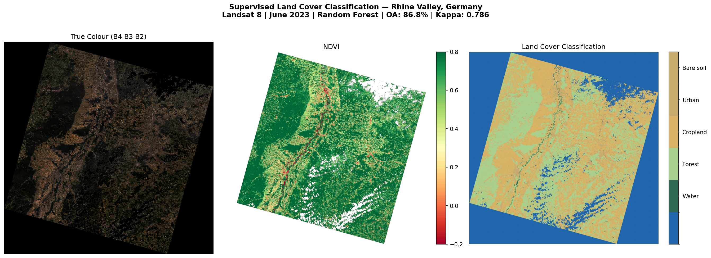

# Supervised Land Cover Classification - Rhine Valley, Germany

Land cover classification of the Rhine Valley region using locally preprocessed Landsat 8 imagery and a Random Forest classifier trained on CORINE Land Cover 2018 ground truth data.

## Objective

This project demonstrates the full local preprocessing pipeline of working directly with raw Landsat Level-1 data without any cloud-based processing infrastructure.

## Study Area & Data

- **Region:** Rhine Valley, Germany (Black Forest, Rhine plain south of Karlsruhe)
- **Satellite:** Landsat 8 OLI, Path 195 / Row 026
- **Acquisition date:** 1 June 2023
- **Scene ID:** LC08_L1TP_195026_20230601_20230607_02_T1
- **Ground truth:** CORINE Land Cover 2018 (Copernicus Land Monitoring Service, 100m)
- **Bounding box:** N 49.5 / S 48.5 / W 7.5E / E 9.5E

## Preprocessing Pipeline

All preprocessing performed locally using Python (rasterio, numpy):

1. **Metadata parsing** - extracted radiometric calibration coefficients (REFLECTANCE_MULT, REFLECTANCE_ADD) and solar elevation angle from MTL.txt
2. **Radiometric calibration** - converted raw Digital Numbers (DN) to Top-of-Atmosphere (TOA) reflectance using USGS scaling formula: `TOA = (MULT x DN + ADD) / sin(sun_elevation)`
3. **Solar angle correction** - normalized for sun angle at acquisition time (sun elevation: 59.95 degrees)
4. **DOS atmospheric correction** - Dark Object Subtraction to reduce Rayleigh scattering haze. Dark object defined as 1st percentile of positive pixel values per band
5. **Cloud masking** - QA_PIXEL band, bit 3 (cloud) and bit 4 (cloud shadow)
6. **Spectral index computation** - NDVI, NDWI, NDBI from corrected reflectance bands

## Training Sample Definition

Training labels derived from **CORINE Land Cover 2018** - an independent, field-validated European land cover dataset produced by the EU Copernicus Land Monitoring Service. 44 CORINE classes were mapped to 5 simplified classes:

| Class | Label | CORINE codes |
|---|---|---|
| 0 | Water | 35-44 (water bodies, wetlands) |
| 1 | Forest | 23-28 (broad-leaved, coniferous, mixed, scrub) |
| 2 | Cropland | 12-22 (arable land, pastures, agricultural areas) |
| 3 | Urban | 1-11 (urban fabric, industrial, transport) |
| 4 | Bare soil | 29-34 (bare rock, sparsely vegetated, burnt areas) |

Using CORINE as ground truth avoids the circular overfitting problem that arises when training samples are defined from the same spectral data used for classification.

## Classifier

**Random Forest** (scikit-learn):
- 100 decision trees
- Max depth: 15
- Min samples per leaf: 5
- Features: 6 Landsat bands (B2-B7)
- Train/test split: 70/30, stratified by class
- Training sample cap: 500,000 pixels randomly subsampled from 17.4M labeled pixels

## Results



### Accuracy Metrics

| Metric | Value |
|---|---|
| Overall Accuracy | 86.76% |
| Kappa Coefficient | 0.786 |

### Per-class Performance

| Class | Precision | Recall | F1-score | Support |
|---|---|---|---|---|
| Water | 0.77 | 0.72 | 0.74 | 1,383 |
| Forest | 0.89 | 0.92 | 0.91 | 60,119 |
| Cropland | 0.86 | 0.89 | 0.88 | 65,732 |
| Urban | 0.80 | 0.71 | 0.75 | 21,821 |
| Bare soil | 0.62 | 0.01 | 0.03 | 945 |

### Land Cover Distribution (valid pixels)

| Class | Coverage |
|---|---|
| Forest | 41.5% |
| Cropland | 47.9% |
| Urban | 10.0% |
| Water | 0.6% |
| Bare soil | 0.0% |

Forest and cropland dominate - consistent with the Black Forest to the east and the agricultural Rhine plain to the west of Karlsruhe.

## Limitations

- **Class imbalance** - Bare soil is extremely rare in the Rhine Valley in June (0.0% of valid pixels), resulting in only 945 test samples and near-zero F1 score (0.03). Water is also underrepresented at 0.6%. Oversampling (SMOTE) or targeted sample collection would improve minority class performance.
- **CORINE resolution mismatch** - CORINE is at 100m resolution while Landsat is at 30m. Nearest-neighbour resampling during reprojection introduces label noise at land cover boundaries, particularly between forest/cropland edges.
- **Training sample cap** - 500,000 pixels were randomly subsampled from 17.4M available labeled pixels to avoid RAM constraints. Stratified subsampling per class would better preserve minority class representation.

## Running with Docker

Docker handles the Python environment so you don't need to install any dependencies locally.

### Prerequisites
Download the following files before running:

1. **Landsat 8 scene** from USGS EarthExplorer (earthexplorer.usgs.gov)
   - Dataset: Landsat Collection 2 Level-1
   - Scene ID: LC08_L1TP_195026_20230601_20230607_02_T1
   - Place all band files in `data/`

2. **CORINE Land Cover 2018** from Copernicus (land.copernicus.eu)
   - File: U2018_CLC2018_V2020_20u1.tif
   - Place in `data/`

### Build the image
```bash
docker build -t rhine-classifier .
```

### Run with volumes
```bash
docker run \
  -v /path/to/your/data:/app/data \
  -v /path/to/your/outputs:/app/outputs \
  -e TRAIN=True \
  rhine-classifier
```
## Data Licenses

- Landsat 8 imagery: USGS public domain
- CORINE Land Cover 2018: Copernicus Land Monitoring Service, free for non-commercial use

## Tools & Libraries

- Python 3.12
- `rasterio` - GeoTIFF I/O and reprojection
- `numpy` - array operations and preprocessing
- `scikit-learn` - Random Forest classifier and evaluation metrics
- `matplotlib` - visualization

## How to Run

```bash
# Step 1 - preprocess and train
# Set TRAIN = True in main.py, then:
python main.py

# Step 2 - visualize
# Set TRAIN = False in main.py, then:
python main.py
```

## References

- USGS Landsat Collection 2 Level-1 Data Format Control Book
- European Environment Agency - CORINE Land Cover 2018 Technical Guide
- Breiman, L. (2001) - Random Forests. Machine Learning, 45(1), 5-32
- Chavez (1988) - An Improved Dark-Object Subtraction Technique for Atmospheric Scattering Correction of Multispectral Data